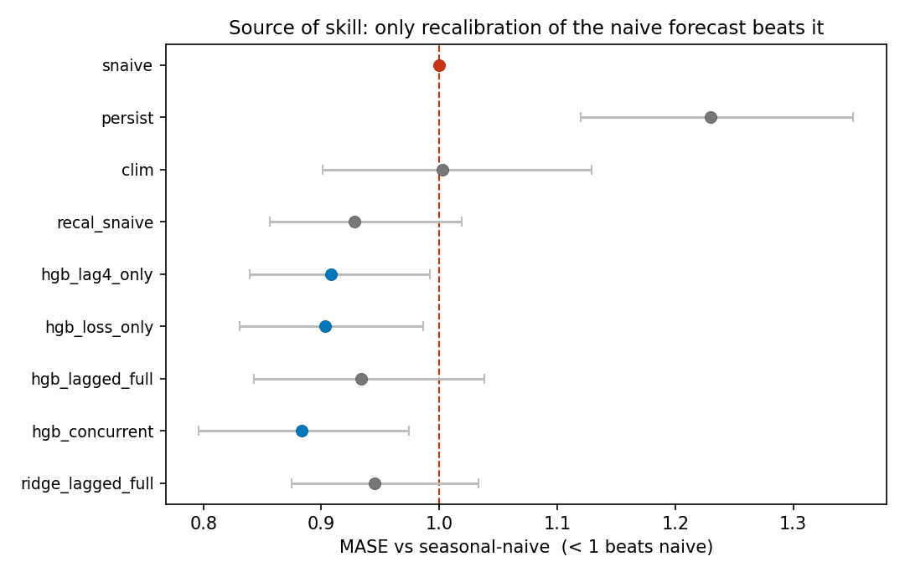

# bee-colony-loss-forecast

[](https://doi.org/10.5281/zenodo.20649336)
&nbsp;[](https://creativecommons.org/publicdomain/zero/1.0/)
&nbsp;[](LICENSE)

**Does bee-colony monitoring *forecast* loss, or only *explain* it?**

A pre-registered, out-of-sample forecasting benchmark for U.S. honey-bee colony loss, built
entirely on public USDA NASS data. The field models colony loss *explanatorily* (in-sample, with
same-quarter "stressor" predictors; Insolia et al. 2022, R²≈0.60). We test whether those stressor
signals actually **predict next quarter's loss out-of-sample** — and they don't.

## Headline result

> **Reported NASS stressor prevalence (Varroa, disease, pesticides…) adds no statistically
> detectable value for forecasting next-quarter colony loss.** Across gradient-boosting and LASSO,
> integer and continuous targets, and full/lean stressor sets, the change in skill from adding
> stressors has a 95% CI spanning zero and an inconsistent sign. The *only* thing that beats the
> seasonal-naive baseline is **recalibration of that baseline** — not recent loss, not the stressors.

This is a clean **"explains ≠ predicts"** result: a strong in-sample R² does not survive an honest
out-of-sample test.



| model (test 2023–25, n=349) | MASE vs seasonal-naive | 95% CI |
|---|---|---|
| loss-only (HGB) | **0.903** | [0.83, 0.99] |
| loss **+ all stressors** | 0.934 | [0.84, 1.04] |
| seasonal-naive | 1.000 | — |

**Honest caveats (in the paper):** underpowered for small effects (pre-registered primary
state-block MDE ≈ 0.09 MASE, ≈0.06 period-block, ~10 effective temporal units) → "no *usable*
signal," not proof of zero; and this concerns the marginal forecasting value of a *noisy survey
measure*, **not** whether stressors *cause* colony loss.

> Note: globally, *managed* honey-bee colonies are **rising**, not collapsing. The real problem is
> high annual U.S. colony-**loss / turnover** — which is what this targets, honestly.

## Artifacts
- **Released dataset:** [`results/bee_colony_panel.csv`](results/bee_colony_panel.csv) (state×quarter, 2015–2025) + [data dictionary](results/DATA_DICTIONARY.md). CC0; NASS is public domain. Archived at Zenodo: [doi:10.5281/zenodo.20649336](https://doi.org/10.5281/zenodo.20649336).
- **Benchmark + leaderboard:** [`results/LEADERBOARD.md`](results/LEADERBOARD.md) — frozen splits, baseline floor, submission rules.
- **Paper draft:** [`docs/paper.md`](docs/paper.md). Pre-registration: [`PRE_REGISTRATION.md`](PRE_REGISTRATION.md) (with logged deviations).
- **Figures:** [`results/figures/`](results/figures).

## Reproduce
```bash
pip install -r requirements.txt
export QUICKSTATS_API_KEY=...           # free: https://quickstats.nass.usda.gov/api
python -m src.fetch_nass --confirm-prereg-locked   # pull 2015–2025 NASS data
python -m src.build_panel                          # build the state×quarter panel
python -m src.analyze                              # primary results + bootstrap CIs
python -m src.robustness                           # continuous target, LassoCV, power/MDE
python -m src.figures                              # regenerate figures
```

See [`PRE_REGISTRATION.md`](PRE_REGISTRATION.md) for the locked analysis plan,
[`data/README.md`](data/README.md) for fetch details, [`docs/paper.md`](docs/paper.md) for the
writeup, and [`docs/related_work.md`](docs/related_work.md) for the prior art.

## Status
Result verified and reproducible. The derived dataset is archived at Zenodo
([doi:10.5281/zenodo.20649336](https://doi.org/10.5281/zenodo.20649336)).
